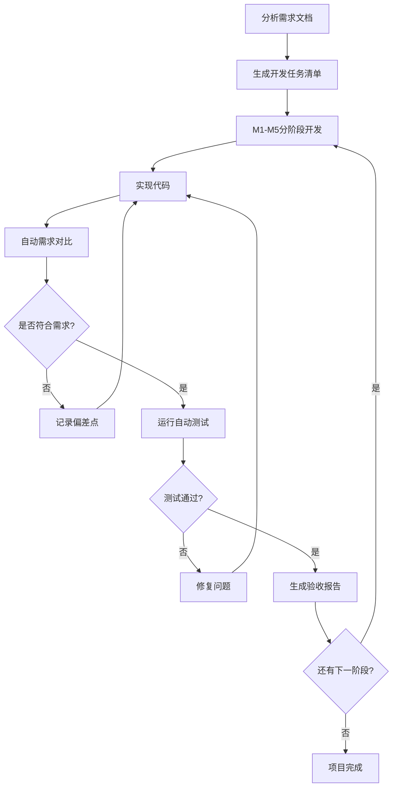

# 《看房笔记》PWA 项目驱动文档（PDD）

## 文档版本
- 版本：v1.0
- 创建日期：2026-02-05
- 状态：开发中

---

## 一、项目概述

### 1.1 项目定义
开发一个PWA（渐进式Web应用），用于快速记录看房信息并通过多维度评分系统进行智能对比和排序。

### 1.2 核心目标
- **现场录入 ≤ 60秒/套**（拍照+速记+重点项）
- **晚上对比 ≤ 5分钟**筛出 Top3
- 支持用户自定义维度（全局生效）
- 支持权重调参后立即改变排序
- 完全离线可用，本地存储

### 1.3 非范围（v1.0）
- 账号体系/云同步
- 多人共享
- 平台房源抓取

---

## 二、技术栈选型

### 2.1 前端框架
```
核心：React 18 + TypeScript
构建工具：Vite
状态管理：Zustand（轻量级）
路由：React Router v6
UI组件：自定义组件（基于视觉设计规范）
样式：Tailwind CSS + CSS Modules
```

### 2.2 PWA能力
```
Service Worker：Workbox
离线存储：IndexedDB（使用 Dexie.js）
图片处理：Browser-image-compression
音频录制：MediaRecorder API
```

### 2.3 开发工具
```
代码质量：ESLint + Prettier
类型检查：TypeScript strict mode
测试：Vitest + React Testing Library
E2E测试：Playwright（可选M5）
```

---

## 三、自动化开发流程设计

### 3.1 流程总览



### 3.2 自动化检查点设计

#### 检查点1：需求符合性验证
每完成一个功能模块后，自动对比：
- 数据模型是否完整（字段、类型、关系）
- 页面结构是否符合PRD定义
- 交互流程是否完整
- 边界处理是否覆盖

#### 检查点2：视觉规范验证
- 色彩系统使用正确性
- 字体系统符合规范
- 间距系统一致性
- 组件尺寸符合规范

#### 检查点3：功能完整性验证
- 用例覆盖率（UC1-UC5）
- 核心功能可用性
- 离线功能可用性
- 自动保存机制

---

## 四、分阶段开发计划

### M1: 房源CRUD + 照片分类 + 速记（5-7天）

#### 开发步骤
1. **项目初始化**（0.5天）
   - [ ] 创建Vite + React + TypeScript项目
   - [ ] 配置Tailwind CSS
   - [ ] 配置路由结构
   - [ ] 配置IndexedDB（Dexie.js）
   - [ ] 配置PWA（Service Worker）

2. **数据层实现**（1天）
   - [ ] 定义TypeScript类型（Visit, Photo, VoiceMemo等）
   - [ ] 实现IndexedDB Schema
   - [ ] 实现数据访问层（CRUD操作）
   - [ ] 实现自动保存机制（300ms debounce）

3. **照片管理**（1.5天）
   - [ ] 实现拍照/选择照片功能
   - [ ] 实现照片分类（5个固定分类）
   - [ ] 实现缩略图生成
   - [ ] 实现照片预览和删除
   - [ ] 实现Blob存储

4. **速记功能**（1天）
   - [ ] 实现文字速记输入框
   - [ ] 实现语音录制功能
   - [ ] 实现语音列表（播放/删除）
   - [ ] 实现Tab切换（打字/语音）

5. **房源列表页**（1天）
   - [ ] 实现房源卡片组件
   - [ ] 实现列表展示
   - [ ] 实现+ 记录一套房按钮
   - [ ] 实现indexNo自增逻辑

6. **房源编辑页**（1.5天）
   - [ ] 实现基础信息表单
   - [ ] 实现照片模块
   - [ ] 实现速记模块
   - [ ] 实现自动保存
   - [ ] 实现页面导航

7. **M1验收**（0.5天）
   - [ ] 运行UC1测试用例
   - [ ] 运行UC2测试用例（30套数据不混）
   - [ ] 需求对比检查
   - [ ] 生成M1验收报告

#### M1自查清单
```
数据模型验证：
✓ Visit对象包含所有必需字段
✓ Photo对象包含category, blobPath, thumbBlobPath
✓ VoiceMemo对象包含audioBlobPath, durationMs
✓ indexNo自增逻辑正确

功能验证：
✓ 拍照后照片自动归类到正确分类
✓ 缩略图生成成功
✓ 语音录制和播放正常
✓ 自动保存在300ms debounce后触发
✓ 离开页面不弹窗确认
✓ 重启后数据仍在

视觉验证：
✓ 页面边距16px
✓ 模块间距24px
✓ 卡片圆角12px
✓ 字体系统符合规范
✓ 色彩系统符合规范
```

---

### M2: 总分计算 + 列表排序 + 筛选（4-5天）

#### 开发步骤
1. **默认维度系统**（1天）
   - [ ] 定义Dimension类型和默认维度库
   - [ ] 实现9项默认精简维度
   - [ ] 实现维度录入控件（rating滑杆、boolean三态、number输入）
   - [ ] 实现维度helpText提示

2. **评分系统核心**（1.5天）
   - [ ] 实现rating → 0-100转换
   - [ ] 实现boolean → 0-100映射
   - [ ] 实现number归一化（通勤、租金）
   - [ ] 实现总分计算公式
   - [ ] 实现默认权重方案

3. **列表功能增强**（1天）
   - [ ] 实现总分显示
   - [ ] 实现标签自动生成（正向/风险）
   - [ ] 实现排序功能（总分/时间/租金/通勤）
   - [ ] 实现候选/淘汰状态切换

4. **筛选系统**（1天）
   - [ ] 实现筛选Drawer组件
   - [ ] 实现状态筛选
   - [ ] 实现租金区间筛选
   - [ ] 实现通勤区间筛选
   - [ ] 实现必须条件筛选

5. **M2验收**（0.5天）
   - [ ] 运行UC3测试用例
   - [ ] 验证总分计算准确性
   - [ ] 验证排序稳定性
   - [ ] 需求对比检查
   - [ ] 生成M2验收报告

#### M2自查清单
```
评分系统验证：
✓ rating(7) → 70分 正确
✓ boolean(是) → 100分 正确
✓ boolean(否) → 0分 正确
✓ boolean(不清楚) → 50分 正确
✓ 通勤20min → 接近100分
✓ 通勤90min → 接近0分
✓ 总分公式计算正确：Σ(score_i * weight_i) / Σ(weight_i)

功能验证：
✓ 筛选条件正确应用
✓ 排序结果正确
✓ 标签生成规则正确（≥80正向，≤30风险）
✓ 候选状态在列表/对比页一致

视觉验证：
✓ 滑杆样式符合规范
✓ 总分显示为22px/600
✓ 标签样式符合规范（圆角999px）
```

---

### M3: 权重设置 + 贡献解释（3-4天）

#### 开发步骤
1. **权重设置页面**（1.5天）
   - [ ] 实现权重列表UI
   - [ ] 实现滑杆拖动控件
   - [ ] 实现启用/禁用开关
   - [ ] 实现数值实时显示
   - [ ] 实现一键归一化功能

2. **ScoreProfile管理**（1天）
   - [ ] 实现ScoreProfile数据结构
   - [ ] 实现默认权重方案
   - [ ] 实现权重方案保存
   - [ ] 实现权重变更后重新计算总分

3. **贡献解释**（1天）
   - [ ] 实现分数贡献计算
   - [ ] 实现详情页breakdown展示
   - [ ] 实现Top5贡献项排序
   - [ ] 实现贡献值可视化

4. **M3验收**（0.5天）
   - [ ] 运行UC4测试用例
   - [ ] 验证权重调整后排序变化
   - [ ] 验证贡献解释准确性
   - [ ] 需求对比检查
   - [ ] 生成M3验收报告

#### M3自查清单
```
权重系统验证：
✓ 权重范围0-100
✓ 拖动滑杆数值实时更新
✓ 归一化后总和=100
✓ 禁用维度不参与计算
✓ 权重变更后总分重新计算

贡献解释验证：
✓ contrib_i = (score_i * weight_i) / Σ(weight)
✓ Top5排序正确
✓ 详情页显示正确

视觉验证：
✓ 权重滑杆细线样式
✓ 数值右侧对齐
✓ 行间距16px
```

---

### M4: 维度管理 + 自定义维度（3-4天）

#### 开发步骤
1. **维度管理页面**（1天）
   - [ ] 实现维度列表展示（分组）
   - [ ] 实现启用/禁用切换
   - [ ] 实现默认展示切换
   - [ ] 实现维度排序

2. **自定义维度**（1.5天）
   - [ ] 实现新建维度表单
   - [ ] 实现维度类型选择（rating/boolean/select/number/text）
   - [ ] 实现select类型的选项配置
   - [ ] 实现scoring规则配置
   - [ ] 实现维度编辑功能

3. **全局维度生效**（1天）
   - [ ] 实现维度变更后所有房源展示同步
   - [ ] 实现维度删除/隐藏逻辑
   - [ ] 实现维度恢复功能
   - [ ] 实现历史值保留

4. **M4验收**（0.5天）
   - [ ] 运行UC5测试用例
   - [ ] 验证自定义维度全局生效
   - [ ] 验证维度删除不丢失历史数据
   - [ ] 需求对比检查
   - [ ] 生成M4验收报告

#### M4自查清单
```
维度管理验证：
✓ 6个维度分组正确展示
✓ 启用/禁用开关工作正常
✓ 默认展示控制正确

自定义维度验证：
✓ 新建维度后所有房源可见
✓ 5种类型都能正确创建
✓ select类型选项配置正确
✓ 自定义维度可参与总分计算

数据完整性验证：
✓ 删除维度时仅隐藏
✓ 历史值保留
✓ 可恢复已删除维度
```

---

### M5: 导出/备份 + 性能优化（2-3天）

#### 开发步骤
1. **导出功能**（1天）
   - [ ] 实现导出JSON（完整数据）
   - [ ] 实现导出CSV（关键字段）
   - [ ] 实现导入JSON恢复数据
   - [ ] 实现存储占用统计

2. **性能优化**（1天）
   - [ ] 实现列表缩略图懒加载
   - [ ] 优化IndexedDB查询
   - [ ] 实现图片压缩
   - [ ] 优化渲染性能

3. **PWA完善**（0.5天）
   - [ ] 配置Service Worker缓存策略
   - [ ] 实现离线提示
   - [ ] 配置manifest.json
   - [ ] 实现添加到主屏幕提示

4. **M5验收**（0.5天）
   - [ ] 验证导出导入完整性
   - [ ] 验证30套房源列表流畅度
   - [ ] 验证离线可用性
   - [ ] 需求对比检查
   - [ ] 生成M5验收报告

#### M5自查清单
```
导出功能验证：
✓ JSON导出包含所有数据
✓ 照片/音频Blob正确导出
✓ 导入后数据完整恢复
✓ CSV导出格式正确

性能验证：
✓ 30套房源列表滚动流畅
✓ 缩略图懒加载工作
✓ 图片大小合理（缩略图<100KB）
✓ 首屏加载<2秒

PWA验证：
✓ 离线可打开应用
✓ 离线可CRUD房源
✓ 离线可拍照录音
✓ 可添加到主屏幕
```

---

## 五、自动化测试策略

### 5.1 单元测试
```typescript
// 测试评分系统
describe('Scoring System', () => {
  test('rating to score conversion', () => {
    expect(ratingToScore(7)).toBe(70);
  });
  
  test('boolean to score conversion', () => {
    expect(booleanToScore(true)).toBe(100);
    expect(booleanToScore(false)).toBe(0);
    expect(booleanToScore(null)).toBe(50);
  });
  
  test('total score calculation', () => {
    const values = {
      light: 8,
      noise: 6,
      rent: 5000,
      commute_min: 30
    };
    const weights = {
      light: 15,
      noise: 15,
      rent: 20,
      commute_min: 25
    };
    expect(calculateTotalScore(values, weights)).toBeCloseTo(68.5, 1);
  });
});
```

### 5.2 集成测试
```typescript
// 测试房源CRUD流程
describe('Visit CRUD', () => {
  test('create and retrieve visit', async () => {
    const visit = await createVisit({
      title: '测试房源',
      community: '测试小区'
    });
    const retrieved = await getVisit(visit.id);
    expect(retrieved.title).toBe('测试房源');
  });
  
  test('auto-save after 300ms', async () => {
    // 测试自动保存机制
  });
});
```

### 5.3 E2E测试（关键用例）
```typescript
// UC1: 首次使用直接记录
test('UC1: First time record', async ({ page }) => {
  await page.goto('/');
  await page.click('text=+ 记录一套房');
  
  // 拍照
  await page.setInputFiles('#camera', 'test-image.jpg');
  
  // 速记
  await page.fill('#quick-note', '采光很好，但窗框有霉点');
  
  // 评分
  await page.fill('#light-slider', '8');
  
  // 返回列表
  await page.click('text=返回');
  
  // 验证
  await expect(page.locator('.visit-card')).toHaveCount(1);
});
```

---

## 六、需求对比自查机制

### 6.1 自动化检查脚本
```typescript
// check-requirements.ts
interface RequirementCheck {
  category: string;
  item: string;
  status: 'pass' | 'fail' | 'partial';
  notes: string;
}

const checks: RequirementCheck[] = [
  {
    category: '数据模型',
    item: 'Visit对象包含所有PRD定义字段',
    status: 'pass',
    notes: ''
  },
  // ... 更多检查项
];

function generateCheckReport() {
  const total = checks.length;
  const passed = checks.filter(c => c.status === 'pass').length;
  console.log(`需求符合性: ${passed}/${total} (${(passed/total*100).toFixed(1)}%)`);
}
```

### 6.2 数据模型检查清单
- [ ] Visit对象字段完整
- [ ] Photo对象字段完整
- [ ] VoiceMemo对象字段完整
- [ ] Dimension对象字段完整
- [ ] ScoreProfile对象字段完整
- [ ] Home配置对象字段完整

### 6.3 页面结构检查清单
- [ ] 首页-房源列表（9个必需元素）
- [ ] 新建/编辑房源（5个分区）
- [ ] 房源详情（解释总分）
- [ ] 对比页（表格视图）
- [ ] 筛选面板（4类筛选项）
- [ ] 权重设置（拖动+归一化）
- [ ] 维度管理（启用/禁用/新建）
- [ ] 设置页面
- [ ] 导出页面

### 6.4 交互流程检查清单
- [ ] 录入≤60秒可完成
- [ ] 自动保存300ms debounce
- [ ] 离开页面不弹窗
- [ ] 拍照自动归类
- [ ] 权重拖动实时变化
- [ ] 排序立即响应

### 6.5 视觉规范检查清单
- [ ] 色彩系统符合（7个颜色定义）
- [ ] 字体系统符合（5个层级）
- [ ] 间距系统符合（6个级别）
- [ ] 组件尺寸符合（卡片/按钮/输入框）
- [ ] 圆角规范符合
- [ ] 动效规范符合

---

## 七、验收标准

### 7.1 功能完整性
- ✓ UC1-UC5所有用例通过
- ✓ 9个页面全部实现
- ✓ 离线功能完全可用

### 7.2 性能标准
- ✓ 首屏加载 < 2秒
- ✓ 列表滚动流畅（30+房源）
- ✓ 拍照到显示 < 1秒
- ✓ 权重调整到重排 < 500ms

### 7.3 数据完整性
- ✓ 重启后数据不丢失
- ✓ 照片不混淆
- ✓ 自动保存可靠
- ✓ 导出导入无损

### 7.4 视觉还原度
- ✓ 视觉验收Checklist全部通过
- ✓ 像Notion一样克制
- ✓ 无超过2种强调色
- ✓ 总分是最大视觉焦点

---

## 八、开发时间表

| 阶段 | 预计工期 | 关键里程碑 |
|------|---------|-----------|
| M1   | 5-7天   | 能记录第一套房 |
| M2   | 4-5天   | 能看到总分和排序 |
| M3   | 3-4天   | 能调权重改排序 |
| M4   | 3-4天   | 能自定义维度 |
| M5   | 2-3天   | 能导出和离线 |
| **总计** | **17-23天** | **完整可用产品** |

---

## 九、风险管理

### 9.1 技术风险
| 风险 | 影响 | 缓解措施 |
|------|------|---------|
| IndexedDB兼容性 | 高 | 使用Dexie.js抽象层 |
| 照片存储超限 | 中 | 实现图片压缩+存储提示 |
| 离线同步冲突 | 低 | v1.0不做云同步 |
| iOS Safari限制 | 中 | 测试PWA安装和存储 |

### 9.2 进度风险
| 风险 | 应对 |
|------|------|
| M1超期 | 简化照片分类UI |
| M2评分系统复杂 | 先实现简单公式 |
| M3权重拖动交互难 | 降级为输入框 |

---

## 十、交付清单

### 10.1 代码交付
- [ ] 完整源代码（GitHub仓库）
- [ ] TypeScript类型定义
- [ ] 组件文档
- [ ] API文档

### 10.2 文档交付
- [ ] 部署指南
- [ ] 用户使用手册（可选）
- [ ] 开发日志
- [ ] 需求符合性报告

### 10.3 测试交付
- [ ] 单元测试覆盖率 > 70%
- [ ] UC1-UC5测试通过报告
- [ ] 性能测试报告
- [ ] 兼容性测试报告

---

## 十一、后续迭代规划（v1.1+）

### v1.1 增强
- 地图集成（自动计算通勤）
- 周边配套自动计算
- 语音转文字
- 权重拖动优化（总和保持100）

### v1.2 扩展
- 暗色模式
- 数据云同步
- 多设备同步
- 分享房源

### v2.0 高级
- AI推荐
- 房源抓取
- 多人协同
- 地图视图

---

## 附录：开发命令速查

```bash
# 初始化项目
npm create vite@latest house-notes -- --template react-ts
cd house-notes
npm install

# 安装依赖
npm install react-router-dom zustand dexie tailwindcss
npm install -D @types/node workbox-cli

# 开发
npm run dev

# 测试
npm run test

# 构建
npm run build

# 预览PWA
npm run preview
```

---

**文档结束**

本PDD将作为整个开发过程的指导文档，每个阶段完成后都会生成对应的验收报告，确保开发质量和需求符合性。
